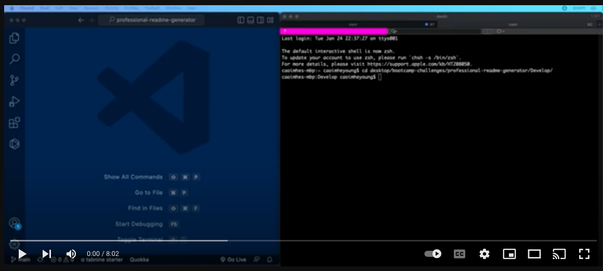

# Professional README Generator
This command-line application generates a professional README file to support creators when coding open source projects.

                [](https://opensource.org/licenses/MIT)


## Description
This project was created to speed up my creation of README files for my projects. By creating this CLI project I am now able to create a README file to my template easily and quickly using CL prompts. 

With this project I was interesting in developing the following skills:
1. NodeJS
2. CLI
3. NPM
4. AXIOS
5. INQUIRER
6. Working across multiple JavaScript files.

## Installation
This program opporates from your command line interface(CLI). First navigate to the application directory. Then run the following commands:

```bash
npm init
npm install inquirer@8.2.4
```

## Usage
Once fully installed, this program is invoked with the following command:
```bash
node index.js
```
Once the application successfully created the README file, the file will be stored in the Develop folder.

To see this program in opperation, watch our live demo!
[](https://www.youtube.com/watch?v=CsS6BedKSkE&ab_channel=CaoimheJyoti)

## Future Developments
1. Look at making the table of contents populate based on user input.
2. Develop styling to include colours within the CLI

## Resources:
https://www.digitalocean.com/community/tutorials/nodejs-interactive-command-line-prompts

https://github.com/matiassingers/awesome-readme

https://www.npmjs.com/package/axios

https://www.npmjs.com/package/inquirer

https://github.com/alexandresanlim/Badges4-README.md-Profile#welcome-badges-4-readmemd-profile

https://www.markdownguide.org/cheat-sheet/

https://javascript.plainenglish.io/how-to-inquirer-js-c10a4e05ef1f

https://docs.github.com/en/rest/users/users?apiVersion=2022-11-28

https://github.com/gofiber/fiber#readme

https://opensource.org/licenses